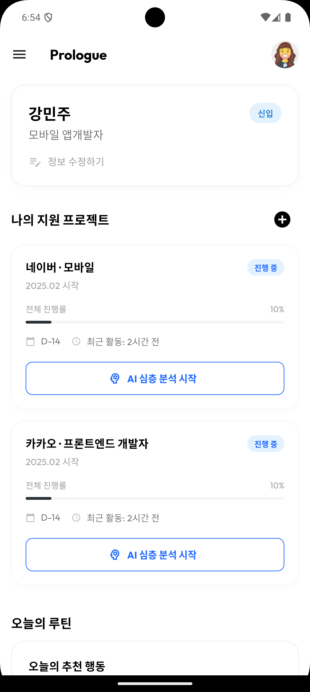
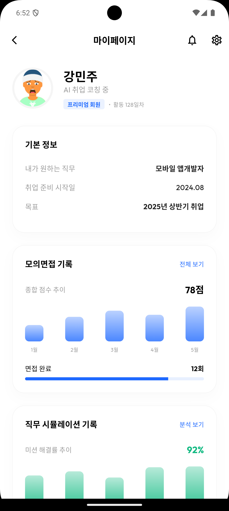

# Pro-Logue
### 커리어라는 본편이 시작되기 전, 나만의 프롤로그를 쓰다
**검증되지 않은 취준을 끝내는 AI 기반 실전 커리어 리플렉션 플랫폼**

<br>

## 🔍 프로젝트 소개

Pro-Logue는  
“이 정도 준비로 괜찮은가?”, “내 경험은 실제로 통할까?”라는 질문에 답하지 못한 채  
불안한 준비를 반복하는 취준생의 현실에서 출발했습니다.

우리는 ‘더 잘 쓰는 자소서’가 아니라  
**현장에서 말할 수 있는 경험**을 만드는 데 집중합니다.  
사용자가 자신의 경험을 **검증 · 전략 · 실전** 관점에서 반복적으로 점검하며,  
면접과 직무 현장에서 **스스로 말하고 판단할 수 있는 사람**이 되도록 돕습니다.

<br>

## 📌 주요 기능

#### 1️⃣ 내 경험 돌아보기
포트폴리오, 노션, 블로그, PDF 등 내가 해온 일을 **AI가 질문으로 살펴보고 스스로 점검**하게 해줍니다.  
*예: “이 프로젝트에서 가장 어려웠던 부분은 뭐야?”, “왜 이런 방식을 선택했어?”*

#### 2️⃣ 선택 이유와 판단 점검
AI가 ‘왜 그렇게 했는지’, ‘어떻게 해결했는지’, ‘문제는 없었는지’ 같은 **핵심 질문을 하나씩 던져** 내 경험과 판단을 명확히 분석하게 합니다.  
> 그냥 답을 알려주는 게 아니라 **스스로 이유를 정리하게 하는 기능**입니다.

#### 3️⃣ 직무 상황 미리 체험하기
AI가 직무에서 벌어질 수 있는 **힘든 상황이나 갈등 상황**을 만들어, 내가 어떻게 대응할지 **실전처럼 연습**할 수 있습니다.  
*예: “팀장이 갑자기 마감일을 앞당겼을 때 어떻게 대응할래?”, “고객이 화가 났을 때 어떤 조치를 취할래?”*

<br>

## 🧰 개발 환경

- **Front**: Flutter, Dart
- **Back-end**: Python, FastAPI, SQLAlchemy
- **DB/Infra**: PostgreSQL, Supabase
- **AI**: Gemini API
- **버전 및 이슈관리**: GitHub
- **협업 툴**: Notion, Discord

<br>

## 🛠 기술 스택

#### Backend


#### Frontend


<br>

## 📂 프로젝트 구조

```
app/
  main.py
  router.py
  controllers/
  services/
  schemas/
  db/
    entities/
    repositories/
  core/
tests/
assets/
```

<br>

<br>

## ✨ 기능 구현 및 기술 포인트

### 1️⃣ 포트폴리오 분석
사용자가 업로드한 포트폴리오 텍스트를 기반으로, FastAPI + SQLAlchemy로 저장된 데이터를 읽어 Gemini API 프롬프트를 구성합니다.  
분석 결과는 핵심 요약, 강점, 논리적 공백, 추가 질문 포인트 형태로 생성되며, 이후 질문 생성 단계에서 재활용할 수 있도록 DB에 저장됩니다.

### 2️⃣ 전략형 유도 질문
포트폴리오 분석 결과와 사용자의 Q/A 히스토리를 결합해 프롬프트를 구성하고, Gemini API로부터 1회 1질문 형태의 응답을 받습니다.  
질문은 대화 흐름을 반영해 꼬리질문이나 새로운 관점으로 확장되며, 사용자가 종료를 요청하면 종료 문구만 반환되도록 설계했습니다.
- 발생한 문제: 분석 결과가 없을 때 질문 생성 실패
- 해결: 분석 결과 존재 여부를 먼저 확인하고 없으면 안내 메시지 반환

### 3️⃣ 포트폴리오 업로드/관리
Notion, 블로그, PDF 등 다양한 소스 타입을 구분해 검증하고, 업로드된 정보를 Pydantic 모델로 관리합니다.  
업로드된 포트폴리오는 SQLAlchemy 기반 DB 저장으로 유지되며, 조회·목록·삭제까지 일관된 흐름으로 처리됩니다.
- 문제: 스키마/엔티티 불일치로 필드 접근 오류
- 해결: 응답 스키마에서 불필요한 필드 제거 후 일관성 유지

### 4️⃣ 직무 시뮬레이션
직무와 공고 맥락을 기반으로 Gemini API를 호출해 “다급한 팀장 / 화난 고객 / 협력사” 등의 페르소나 대화를 생성합니다.  
응답에 따라 논리성, 책임감, 멘탈, 협업 점수를 누적하며, 세션과 대화 로그는 SQLAlchemy로 저장됩니다.  
마지막에는 대화 로그와 누적 점수를 기반으로 유형, 레이더 점수, 베스트/워스트 순간, 요약, 자소서 문구 형태의 리포트를 제공합니다.
- 문제: 세션 로그 누적 중 사용자/AI 턴 순서 꼬임
- 해결: turn_order를 DB에서 최대값 기준으로 계산해 안정적으로 증가 처리

<br>

## 📸 화면 미리보기

<table>
  <tr>
    <td align="center"><br/>메인화면</td>
    <td align="center"><br/>마이페이지</td>
  </tr>
  <tr>
    <td align="center"><br/>프로젝트 심층 인터뷰</td>
    <td align="center"><br/>자소서 작성</td>
  </tr>
  <tr>
    <td align="center"><br/>직무 시뮬레이션 챗봇</td>
    <td align="center"><br/>직무 시뮬레이션 결과</td>
  </tr>
  <tr>
    <td align="center"><br/>모의 면접 진행</td>
    <td align="center"><br/>모의 면접 결과</td>
  </tr>
  <tr>
    <td align="center"><br/>최종 피드백 결과</td>
    <td></td>
  </tr>
</table>

<br>

## 🙋🏻‍♀️ Members

<table>
  <tbody>
    <tr>
      <td align="center">
        <a href="https://github.com/mimo626">
          
          <br /><sub><b>강민주</b></sub>
        </a>
      </td>
      <td align="center">
        <a href="https://github.com/zzmnxn">
          
          <br /><sub><b>박지민</b></sub>
        </a>
      </td>
      <td align="center">
        <a href="https://github.com/knox-glorang">
          
          <br /><sub><b>홍기현</b></sub>
        </a>
      </td>
      <td align="center">
        <a href="https://github.com/yerriiniii">
          
          <br /><sub><b>박예린</b></sub>
        </a>
      </td>
    </tr>
  </tbody>
</table>
